# 用MicroBlocks重新打造机智云开发板的物联功能

**前言**： 本文介绍了用MicroBlocks给机智云开发板刷固件及编写接口文件，然后通过用Python编写代码获取板载光敏电阻的值和远程控制RGB LED的亮灭，完整体验了浙教版《信息科技》七下“探秘物联网”模块的相关内容。尤其是MicroBlocks的固件刷入、接口编写、调试十分容易，真正是懒人的福音。

#### 一、ESP8266 机智云开发板简介  
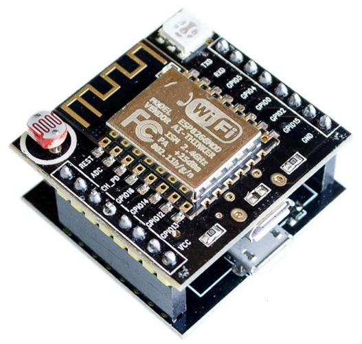
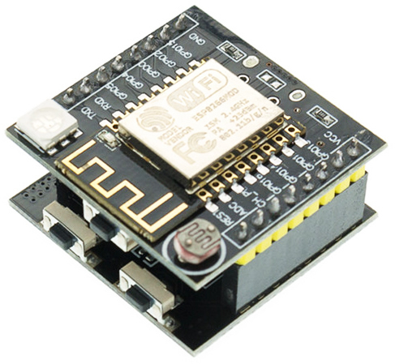
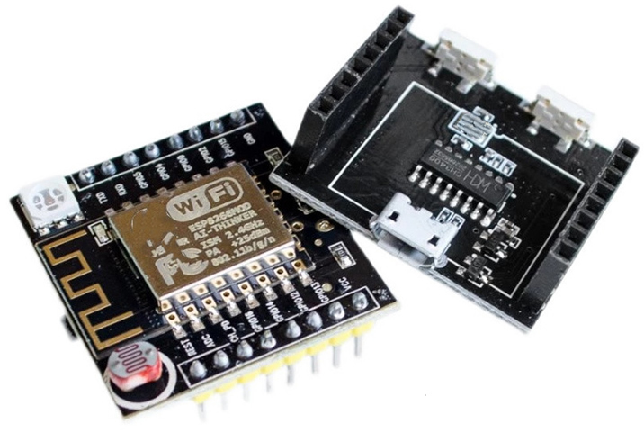

&emsp;&emsp;该板是安信可于2017年前后推出的，它基于ESP8266研发，板载1颗三色RGB LED，光敏电阻，3.3V LDO电源模块，以及1个轻触按键，目前其价格十分便宜，大概10元左右。 

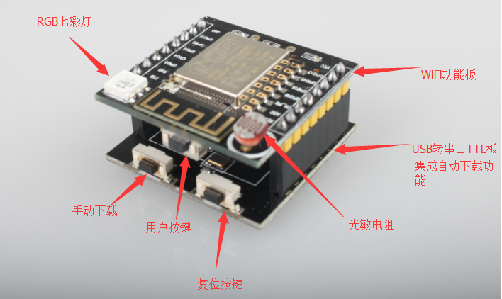

其官方原理图([下载](https://docs.ai-thinker.com/_media/esp8266/boards/gizwits/sch.7z))如下：

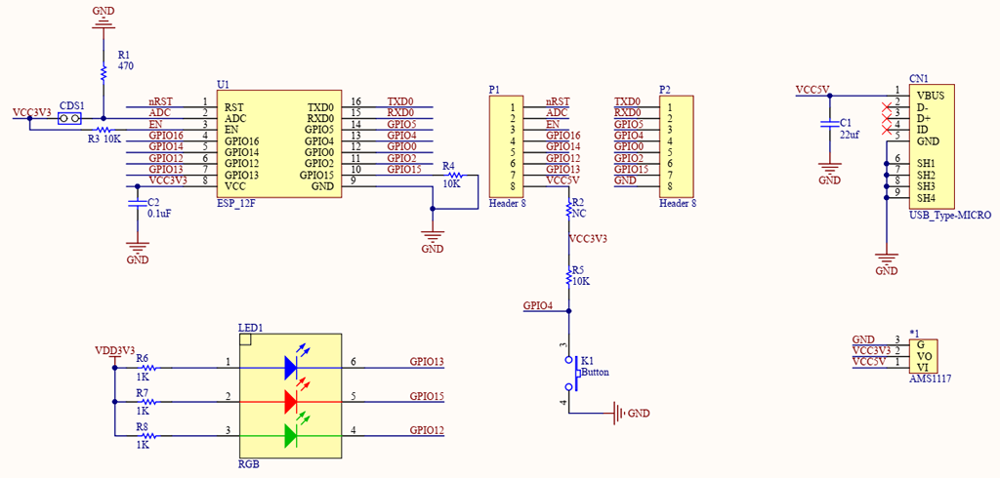  

刚推出时，该板号称史上最简单、最具性价比的物联网开发板，支持云端的智能硬件开发，不需要你懂网络、TCP/IP、HTTP、MQTT底层复杂的知识，只要你会C语言，即可用安信可的机智云SDK快速实现二次开发。然而会C语言，很多人只能呵呵了，但有了MicroBlocks才真正实现了零基础的硬件控制，重新焕发这款开发板的物联功能。    
#### 二、用MicroBlocks刷固件    
&emsp;&emsp;打开[MicroBlocks](https://microblocksfun.cn/run/microblocks.html)软件，在“设置”菜单中选择“显示高级积木”，然后在在“设置”菜单中选择“擦除信息并并升级ESP固件”，接着依次选择主板为“ESP8266” → 选择“连接主板” → 选择相应的串口(如：COM5) → 选择“连接”按钮，即进入固件烧写阶段。    
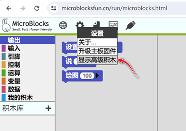
等待烧写完成后一般会自动连接(USB图标背景为绿色)开发板。若未连接，则选择“连接”菜单进行连接。   
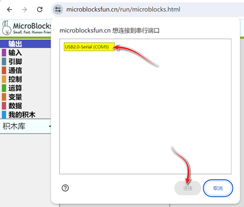

#### 三、用MicroBlocks编写接口固件   
##### 1. 测试ESP8266芯片上的LED灯   
就像我们编写程序时，常用Hello World测试一样，测试硬件时，常用Blink进行测试，可以用如下脚本测试固件是否烧写成功及ESP8266芯片上的LED指示灯：    

你可以直接下载上述图片并拖入MicroBlocks软件窗口进行测试，或者点击[blink.udp](https://microblocksfun.cn/run/microblocks.html#project=https://tzbingo.github.io/posts/img/blink.ubp)打开这个例子。  
##### 2. 用按键A控制板载的彩灯 
为了控制板载的RGB LED，需要知道其连接在ESP8266的那些引脚，可以参考如下列表：  

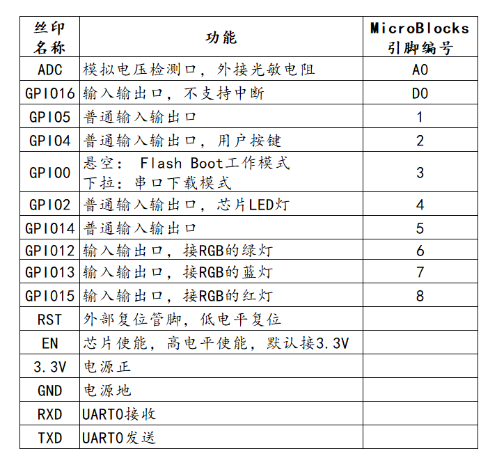  
 
&emsp;&emsp;因为引脚6、7、8分别接绿、蓝、红灯，因此可以通过简单的1-3循环再加5即可控制RGB LED。    

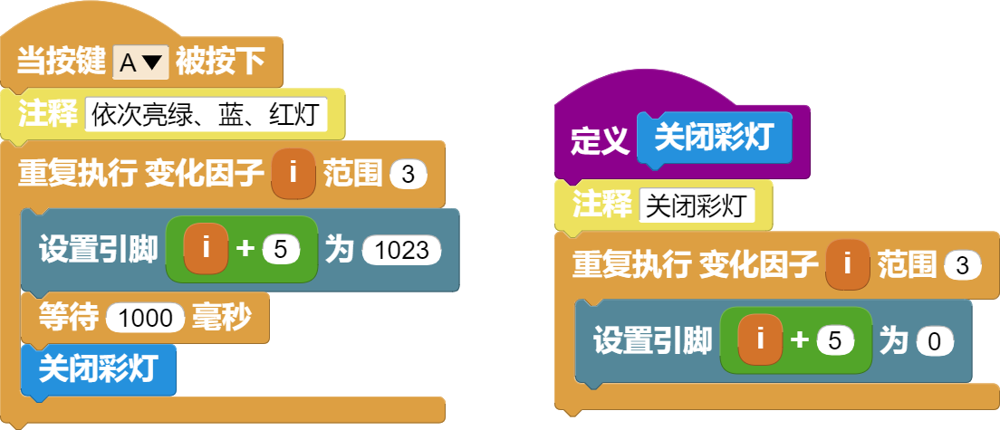    

上述的这个例子，实现了当按下按键A(即下方板子上的FLASH键)时，依次亮绿灯、蓝灯、红灯。    
##### 3. 用消息的方式控制彩灯
&emsp;&emsp;用消息通信的方式进行控制，可以增加系统控制的灵活性和健壮性、减少耦合性。首先，我们先定义一个简单的控制协议，用编码off表示关灯，用编码on表示开灯，用(r,g,b)表示红绿蓝颜色，因此on(255,0,0)即表示打开红灯。

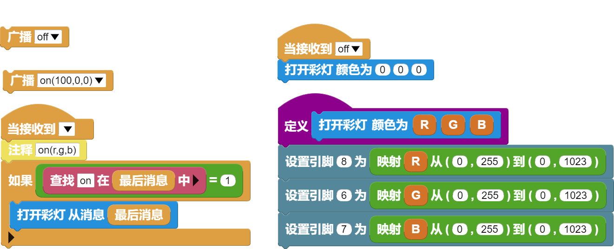  

上面的例子，从信息科技学科来看，涉及的学科概念主要有编码、协议、系统、控制等。    
##### 4. 用Python控制彩灯    
&emsp;&emsp;浙教版的信息科技教材中，一般要求学生用Python语言实现控制硬件，我们可以利用上述的消息机制，通过串口通信协议，对硬件进行控制，MicroBlocks一端可以看作是固件编写，python一端看作客户端控制。
为了能够使Python访问串口，需要安装microblocks_messaging_library库。

```bash
 pip install microblocks_messaging_library 
```

接下来的Python控制代码如下：

```python
from microblocks_messaging_library import MicroblocksSerialMessage
import time
m = MicroblocksSerialMessage()
m.connect("COM5")
m.sendBroadcast("on(255,0,0)")
time.sleep(2)
m.sendBroadcast("on(0,255,0)")
time.sleep(2)
m.sendBroadcast("on(0,0,255)")
time.sleep(2)
m.sendBroadcast("on(0,0,0)")
```
这个例子实现每隔2秒依次亮红、绿、蓝灯，然后关灯。

#### 四、结合教材，探秘物联网   
##### 1. 测试MQTT协议  
在物联网中，数据的发送和接收主要基于MQTT协议，为了方便学校教学，浙江省专门搭建了一个物联数据中台。
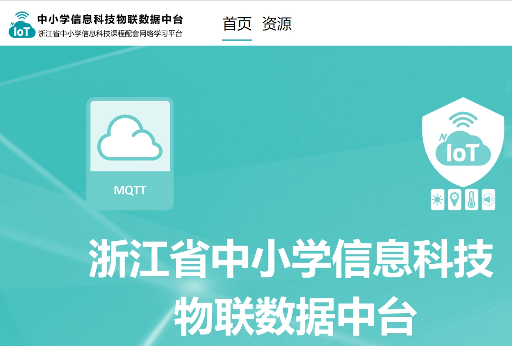
为了方便网络连接和MQTT访问，可以先安装siot库。
```bash
 pip install siot 
```
然后用如下代码模拟外界光线值来测试物联网数据的发布。
```python
import siot,time,random
srv="121.5.75.157"
port=1883
user='you_user'
psw='you_password'
topic='you_project_code/Lux'
siot.init('',srv,user=user,password=psw)
siot.connect()
for i in range(10):
    lux=random.randint(500,1000)
    print(f"模拟光照值:{lux}")
    siot.publish(topic,str(lux))
    time.sleep(3)
```
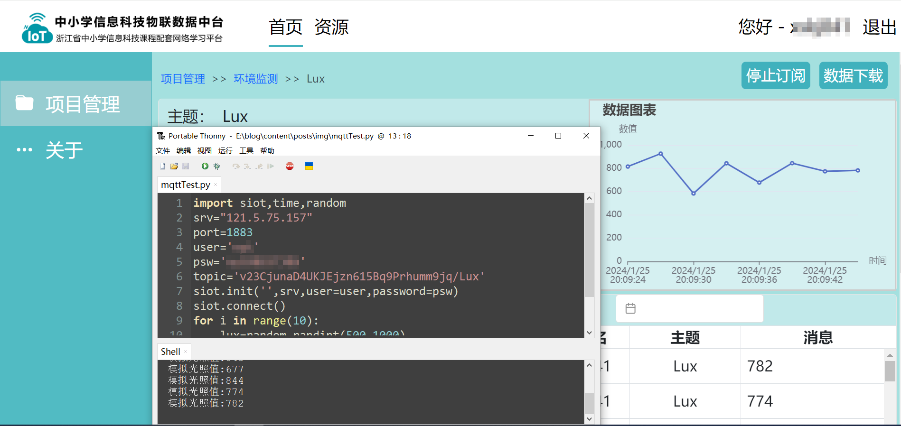
再用如下代码来测试物联网数据的订阅。
```python
import siot,time,random
srv="121.5.75.157"
port=1883
user='you_user'
psw='you_password'
topic='you_project_code/Lux'
def sub_cb(client,userdata,msg):
    value=(msg.payload).decode('utf-8')
    tp=(msg.topic).split('/')[1]
    if tp=='Lux':
        print(f'接收到消息:{value}')        
siot.init('',srv,user=user,password=psw)
siot.connect()
siot.subscribe(topic,sub_cb)
siot.loop()
```
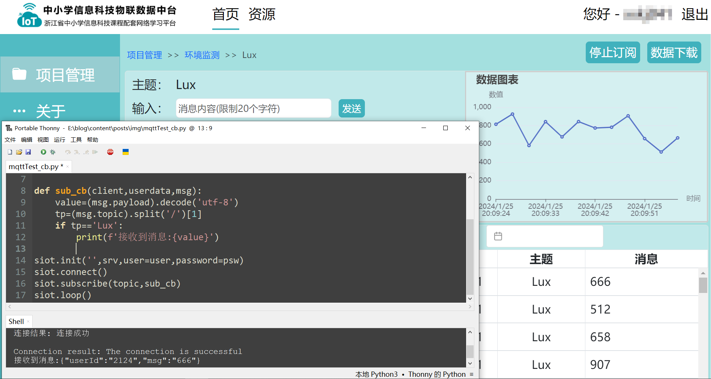
##### 2. 订阅主题控制彩灯    
当上述测试都成功后，就可以将MQTT的消息订阅与前面的彩灯控制结合起来，实现一个物联网的彩灯控制。
我们知道彩灯颜色可以看作是红、绿、蓝三原色组成，但生活中，我们通常用名称来表达颜色，因此可以先设计如下查表计算(五下教材内容)。
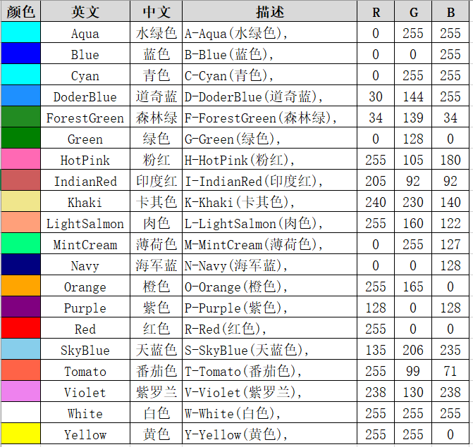
具体的物联订阅控制彩灯代码如下：
```python
import siot,time,random
srv="121.5.75.157"
port=1883
user='you_user'
psw='you_password'
topic='you_project_code/RgbLed'
#颜色查表计算
color={"red":"255,0,0","green":"0,255,0","blue":"0,0,255","yellow":"255,255,0","cyan":"0,255,255","purple":"128,0,128"}
#连接ESP8266硬件
m = MicroblocksSerialMessage()
m.connect("COM5")
def sub_cb(client,userdata,msg):
    value=eval((msg.payload).decode('utf-8'))
    if msg.topic==topic:
        print(f"控制彩灯颜色为：{value['msg']}")
        m.sendBroadcast(f"on({color[value['msg']]})")        
siot.init('',srv,user=user,password=psw)
siot.connect()
siot.subscribe(topic,sub_cb)
siot.loop()
```
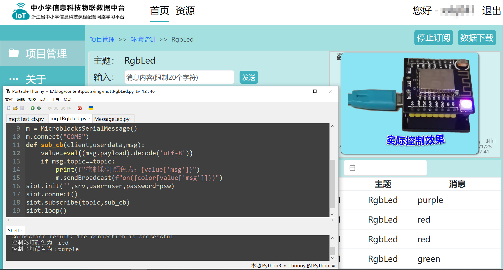
##### 3. 发布环境光强到物联网    
从前面的开发板硬件介绍中可知，该开发板带有一个光敏电阻，它可用来感知外界环境的光线强度。为了能够使用该传感器，需要使用MicroBlocks对固件进行一些修改。
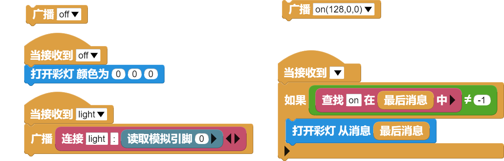 
下面代码实现了每隔3秒向物联中台发布环境光强：
```python
from microblocks_messaging_library import MicroblocksSerialMessage
import siot,time
srv="121.5.75.157"
port=1883
user='you_user'
psw='you_password'
topic='you_project_code/Lux'
siot.init('',srv,user=user,password=psw)
siot.connect()
#连接ESP8266硬件
m = MicroblocksSerialMessage()
m.connect("COM5")
while True:
    m.sendBroadcast('light')
    while True:
        msg=m.receiveBroadcasts()
        if not msg is None:
            light=msg.split(':')
            break    
    if light[0]=='light':
        print(f"环境光强:{light[1]}")
        siot.publish(topic,light[1])
    time.sleep(3)
```
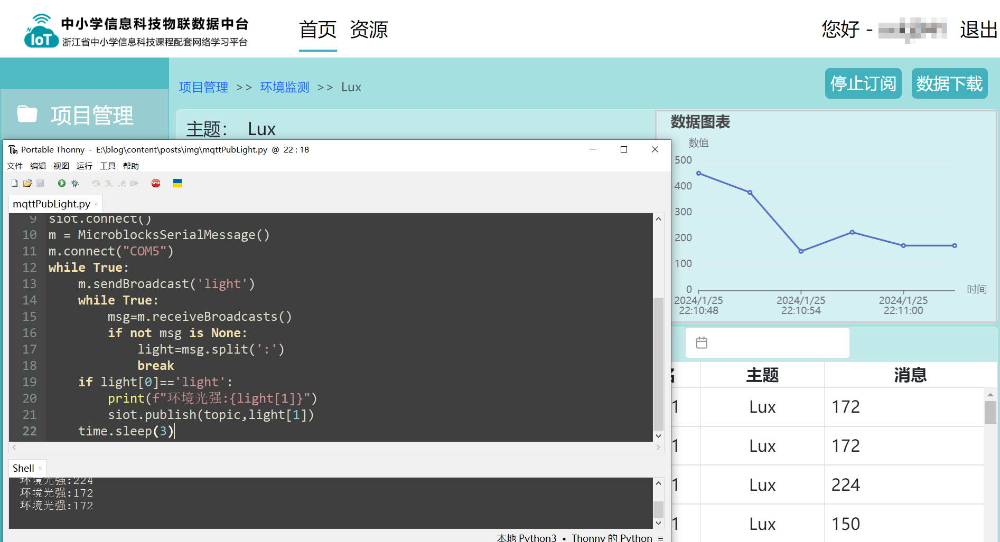
至此，我们的物联网探秘告一段落了。    
#### 题外的话
如果你对MicroPython比较熟悉，这款开发板也完全支持，只要把固件刷成micropython即可。
