# 用MicroBlocks重新打造机智云开发板的物联功能

**前言**： 本文介绍了用MicroBlocks给机智云开发板刷固件及编写接口文件，然后通过用Python编写代码获取板载光敏电阻的值和远程控制RGB LED的亮灭，完整体验了浙教版《信息科技》七下“探秘物联网”模块的相关内容。尤其是MicroBlocks的固件刷入、接口编写、调试十分容易，真正是懒人的福音。

#### 一、ESP8266 机智云开发板简介  
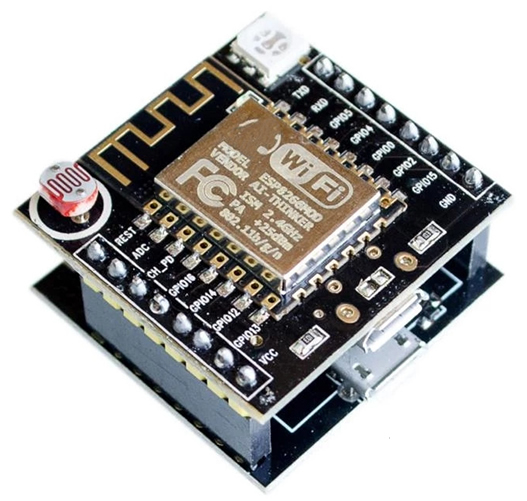
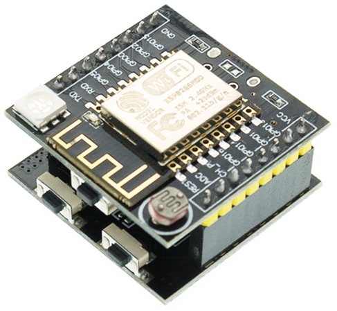
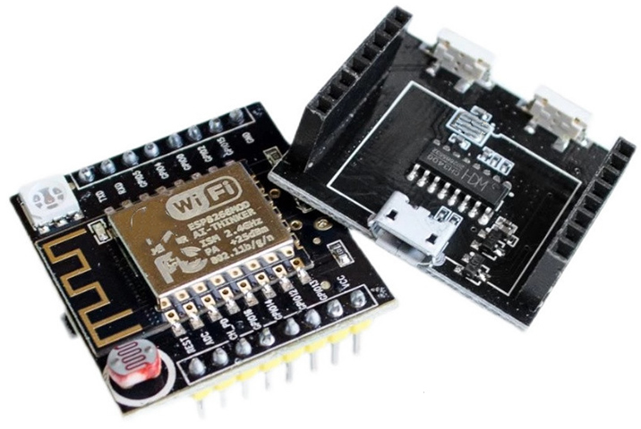

&emsp;&emsp;该板是安信可于2017年前后推出的，它基于ESP8266研发，板载1颗三色RGB LED，光敏电阻，3.3V LDO电源模块，以及1个轻触按键，目前其价格十分便宜，大概10元左右。 

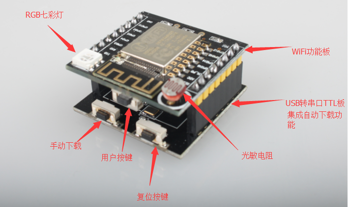

其官方原理图([下载](https://docs.ai-thinker.com/_media/esp8266/boards/gizwits/sch.7z))如下：

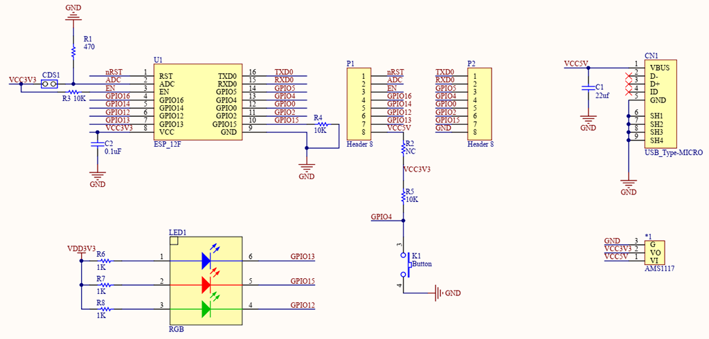  

刚推出时，该板号称史上最简单、最具性价比的物联网开发板，支持云端的智能硬件开发，不需要你懂网络、TCP/IP、HTTP、MQTT底层复杂的知识，只要你会C语言，即可用安信可的机智云SDK快速实现二次开发。然而会C语言，很多人只能呵呵了，但有了MicroBlocks才真正实现了零基础的硬件控制，重新焕发这款开发板的物联功能。    
#### 二、用MicroBlocks刷固件    
&emsp;&emsp;打开[MicroBlocks](https://microblocksfun.cn/run/microblocks.html)软件，在“设置”菜单中选择“显示高级积木”，然后在在“设置”菜单中选择“擦除信息并并升级ESp固件”，接着依次选择主板为“ESP8266” → 选择“连接主板” → 选择相应的串口(如：COM5) → 选择“连接”按钮，即进入固件烧写阶段，等待烧写完成后一般会自动连接(USB图标背景为绿色)开发板。若未连接，则选择“连接”菜单进行连接。
<div style="text-align:center;color:#969696;">
    <div style="float:left;width:310px;margin-right:10px;">
        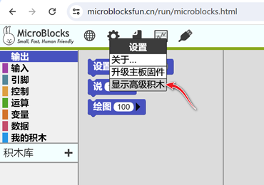显示高级积木
    </div>
    <div style="overflow:hidden;">
        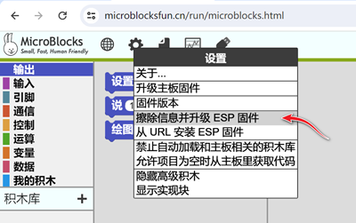擦除信息并升级ESp固件
    </div>
</div>
<br/>
<div style="text-align:center;color:#969696;">
    <div style="float:left;width:305px;margin-right:10px;">
        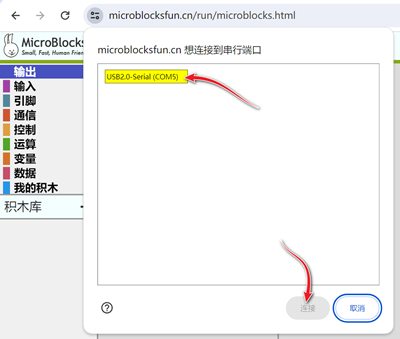串口连接
    </div>
    <div style="overflow:hidden;">
        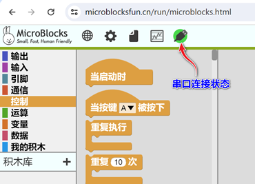串口连接状态
    </div>
</div>

#### 三、用MicroBlocks编写接口固件   
##### 1. 测试ESP8266上的LED灯   
我们可以用如下脚本测试固件是否烧写成功及ESP8266芯片上的LED指示灯：    
&emsp;&emsp;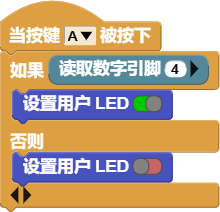    
&emsp;&emsp;可以直接下载上述图片并拖入MicroBlocks软件窗口进行测试，或者点击[LED灯控制](https://microblocksfun.cn/run/microblocks.html#project=https://tzbingo.github.io/posts/img/test_led.ubp)打开这个例子，然后通过按键A(即下方板子上的FLASH键)即可开关LED灯。  
##### 2. 用按键A控制板载的彩灯 
为了控制板载的RGB LED，需要知道其连接在ESP8266的那些引脚，可以参考如下列表：  

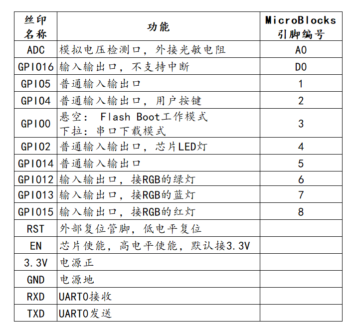  
 
&emsp;&emsp;因为引脚6、7、8分别接绿、蓝、红灯，因此可以通过简单的1-3循环再加5即可控制RGB LED。    

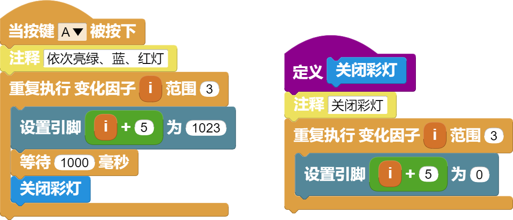    

上述的这个例子，实现了当按下按键A时，依次亮绿灯、蓝灯、红灯。    
##### 3. 用消息的方式控制彩灯
&emsp;&emsp;用消息通信的方式进行控制，可以增加系统控制的灵活性和健壮性。首先，我们先定义一个简单的控制协议，用编码off表示关灯，用编码on表示开灯，用(r,g,b)表示红绿蓝颜色，因此on(255,0,0)即表示打开红灯。

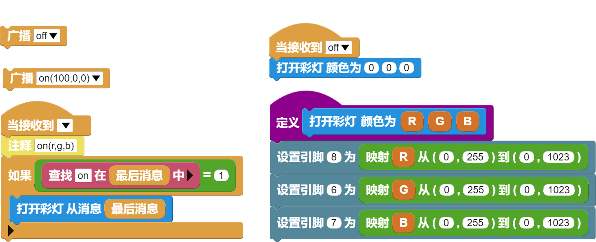  

上面的例子，从信息科技学科来看，主要涉及编码、协议、系统、控制等概念。    
##### 4. 用Python控制彩灯    
&emsp;&emsp;要用Python控制硬件，一般都是通过串口通信协议，该方法局限的地方有很多，首先是插拔不方便，其次，不能发挥ESP8266网络功能，而MicroBlocks的Wifi广播功能可以很好地解决上述问题。且其接口的固件编写简单，一次编写后，就可以直接连接无线网络，在Python中编写代码进行控制。其接口固件程序如下：

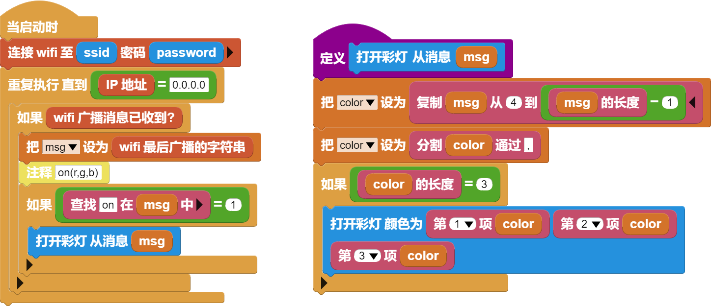

&emsp;&emsp;为了能够使Python访问Wifi广播，需要安装microblocks_wifi_radio库。

```bash
 pip install microblocks_wifi_radio 
```

接下来的Python控制代码如下：

```python
from microblocks_wifi_radio import Radio
import time
r = Radio()
r.send_string("on(255,0,0)")
time.sleep(1)
r.send_string("on(0,255,0)")
time.sleep(1)
r.send_string("on(0,0,255)")
time.sleep(1)
r.send_string("on(0,0,0)")
```

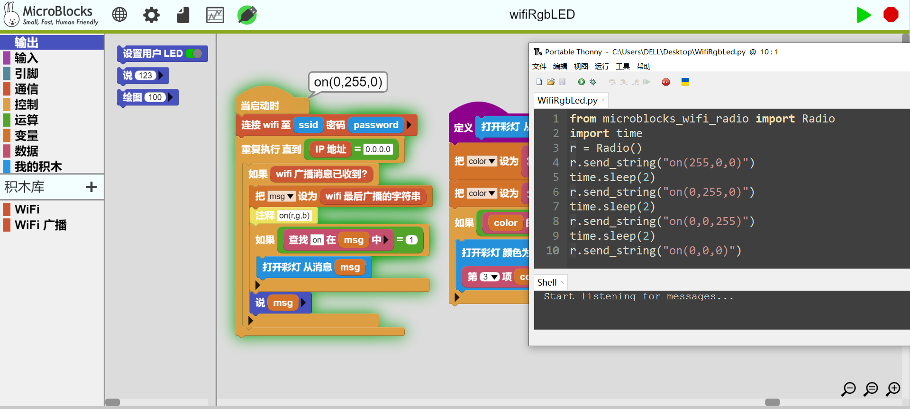

这个例子实现每隔1秒依次亮红、绿、蓝灯并关闭。

#### 四、结合教材，探密物联网   
##### 1. 测试MQTT协议  
待续...
